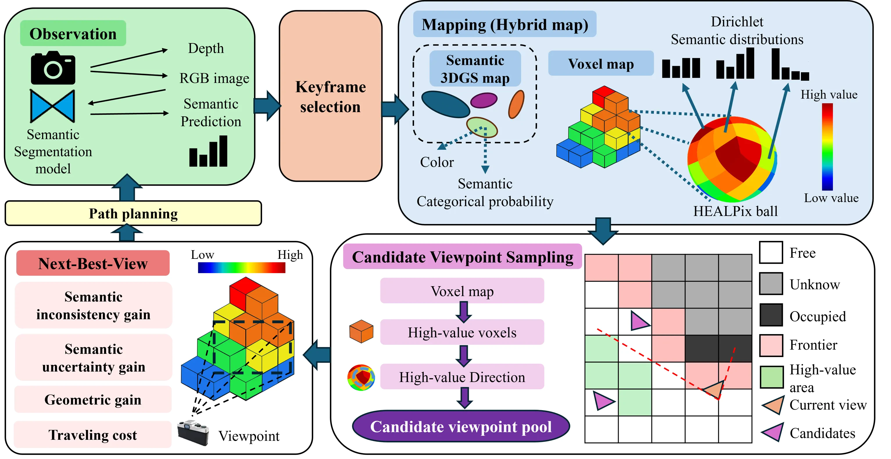

# ActiveSIGMA: Semantic Inconsistency-Guided Active Mapping

<p align="center">
  <a href="https://jimmy94828.github.io/ActiveSIGMA/"><strong>Project Page</strong></a> ·
  <a href="https://jimmy94828.github.io/ActiveSIGMA/files/activesigma-paper.pdf">Paper</a> ·
  <a href="https://jimmy94828.github.io/ActiveSIGMA/files/activesigma-supplementary.pdf">Supplementary</a> ·
  <a href="https://jimmy94828.github.io/ActiveSIGMA/files/activesigma-poster.pdf">Poster</a>
</p>

> IROS 2026 Workshop — [SeMaNa: Semantic-Aware Mapping and Navigation — Towards Cognitive and Adaptive Robots](https://federicorollo.github.io/SeMaNa-Workshop/)

This repository is an implementation of ActiveSIGMA: Semantic Inconsistency-Guided Active Mapping, derived from the ActiveSGM codebase with a SplaTAM-based semantic Gaussian mapping backend. The main planner is `src/planner/semantic_heat_planner.py` and the main entry point is `src/main/activesgm.py`.

<p align="center">
  <a href="https://jimmy94828.github.io/ActiveSIGMA/">
    
  </a>
</p>

ActiveSIGMA preserves direction-conditioned semantic evidence in a hybrid Gaussian–voxel map, converts cross-view inconsistency into directional exploration heat, and uses it to guide candidate generation and next-best-view selection.

## 1. Requirements

The tested setup uses:

- Ubuntu/Linux
- Python 3.8
- NVIDIA driver with a CUDA-compatible installation
- CUDA 11.7 and PyTorch 1.13.1, as configured by the default installer
- At least two visible GPUs for the released configurations
- Conda or Miniforge
- `git`, `wget`, `unzip`, `unpigz`, `jq`, a C++ compiler, CMake, and the CUDA toolkit

The default configuration uses `cuda:0` for mapping/planning and `cuda:1` for OneFormer semantic inference. For a single-GPU machine, change `semantic_device` in the selected configuration file to an available device, for example `cuda:0`.

The dependency versions are old research versions. Newer Python, PyTorch, CUDA, or Habitat-Sim versions may require changes to the installation script and CUDA extensions.

## 2. Clone the repository

Clone the repository with its submodules:

```bash
git clone --recursive https://github.com/jimmy94828/ActiveSIGMA.git
cd ActiveSIGMA
```

If the repository was already cloned without submodules:

```bash
git submodule update --init --recursive
```

The submodules listed in `.gitmodules` provide Co-SLAM, SplaTAM, neural evaluation code, and semantic Gaussian rasterizers. Habitat-Sim is downloaded by the installation script into `third_parties/habitat_sim` if it is not already present.

## 3. Create the Conda environment

Run the installer from the repository root:

```bash
bash scripts/installation/conda_env/build_sem.sh
conda activate ActiveSIGMA
```

The environment is named `ActiveSIGMA`. ActiveSGM is the upstream project name and acknowledgement, not the environment name. Do not use `activemapping_conda_config` as a portable environment file; it contains a machine-specific Conda `prefix`.

The installer performs the following actions:

1. Creates the `ActiveSIGMA` Python 3.8 environment.
2. Builds headless Habitat-Sim.
3. Installs the pinned PyTorch, PyTorch3D, tiny-cuda-nn, rasterization, semantic, and sparse tensor dependencies.
4. Builds the Co-SLAM marching-cubes extension.
5. Attempts to download and prepare Replica data.

The last step may require a large download and the Replica data license. The script also calls `sudo apt install jq` through `scripts/data/replica_update.sh`; install `jq` before running the installer if sudo is unavailable. If the automatic data bootstrap is interrupted, complete the manual dataset steps below and rerun only the missing steps.

Check the environment before continuing:

```bash
conda activate ActiveSIGMA
python -c "import torch; print(torch.__version__); print(torch.cuda.is_available()); print(torch.cuda.device_count())"
```

## 4. Build semantic CUDA rasterizers

The semantic Gaussian rasterizer submodules are included through `.gitmodules`. Build both extensions after activating the environment.

### Dense channel rasterization

Edit `config.h` in `third_parties/channel_rasterization/channel-rasterization/cuda_rasterizer` and set `NUM_CHANNELS` to the dataset class count:

- Replica: `102`
- MP3D: `41`

Then install it:

```bash
cd third_parties/channel_rasterization/channel-rasterization
python setup.py install
pip install .
cd ../..
```

### Sparse channel rasterization

Edit `config.h` in `third_parties/sparse_channel_rasterization/sparse-channel-rasterization/cuda_rasterizer`:

```text
NUM_CHANNELS = 102  # Replica
NUM_CHANNELS = 41   # MP3D
TOP_K_LOGITS_CHANNELS = 16
```

Build it with:

```bash
cd third_parties/sparse_channel_rasterization/sparse-channel-rasterization
python setup.py install
pip install .
cd ../..
```

If the extensions fail to compile, first verify that `nvcc`, the active PyTorch CUDA version, and the NVIDIA driver are compatible.

## 5. Download Replica data

Replica data is not included in GitHub. Run these commands from the repository root:

```bash
mkdir -p data
bash scripts/data/replica_download.sh data/replica_v1
bash scripts/data/replica_update.sh data/replica_v1
bash scripts/data/replica_slam_download.sh
```

The expected layout for `office0` includes:

```text
data/replica_v1/office_0/habitat/info_semantic.json
data/replica_v1/office_0/habitat/replicaSDK_stage.stage_config.json
data/Replica/office0/traj.txt
data/replica_sim_nvs/office0/...
```

The `SemanticHeat.py` configurations derive `office0` to `office_0` and `room0` to `room_0` automatically. For example, `office0` uses `data/replica_v1/office_0/habitat/`.

Before running an experiment, verify the metadata file:

```bash
test -f data/replica_v1/office_0/habitat/info_semantic.json
```

## 6. Download Matterport3D data

Matterport3D requires separate access approval and acceptance of its terms of use. The scan IDs used by this project are listed in `scripts/data/scan_id.txt`.

Download the scan data and Habitat task data to a selected directory:

```bash
bash scripts/data/download_mp3d.sh data/MP3D
```

The first argument is optional and defaults to `data/MP3D`. The downloader can be called with one scan ID at a time by editing `scripts/data/scan_id.txt` or by invoking `src/data/download_mp.py` directly.

The MP3D SemanticHeat configuration expects semantic metadata containing `info_semantic.json`. If that metadata is not under the default scene directory, set the directory explicitly before running:

```bash
export ACTIVE_SIGMA_SEMANTIC_DIR=/absolute/path/to/directory/with/info_semantic.json
test -f "$ACTIVE_SIGMA_SEMANTIC_DIR/info_semantic.json"
```

Generate the MP3D simulation/NVS data required by the released configs. Run this command from the repository root:

```bash
bash scripts/data/generate_mp3d_nvs.sh GdvgFV5R1Z5 generate_nvs_data 0 0
```

Use another scene ID to generate its data. The runner looks first for `data/mp3d_sim_nvs_v2/<scene>/traj.txt` and otherwise falls back to `data/mp3d_sim_nvs/<scene>/traj.txt`.

## 7. OneFormer checkpoints

SemanticHeat uses these Hugging Face checkpoints. Transformers downloads them on first use:

- Replica: `lly00412/oneformer-replica-finetune`
- MP3D: `lly00412/oneformer-mp3d-finetune`
- ADE20K processor/model: `shi-labs/oneformer_ade20k_swin_large`

The machine must be able to access Hugging Face. For an offline setup, download the checkpoints first and replace the checkpoint names in the selected configuration files with local paths.

## 8. Run ActiveSIGMA

Activate the environment and run from the repository root or call the runner with its path. The runners resolve the project root from their own location.

The arguments are:

```text
SCENE NUM_RUN EXP ENABLE_VIS GPU_IDS
```

### Replica example

```bash
conda activate ActiveSIGMA
bash scripts/activesgm/run_replica.sh office0 1 SemanticHeat 0 0,1
```

### MP3D example

```bash
conda activate ActiveSIGMA
bash scripts/activesgm/run_mp3d.sh GdvgFV5R1Z5 1 SemanticHeat 0 0,1
```

Set `ENABLE_VIS=0` on a headless server. For a visual run, configure `DISPLAY` and, when needed, `XAUTHORITY` for the local X server.

The default output directory is `results/`. Redirect it without editing the scripts:

```bash
RESULT_ROOT=/absolute/path/to/results \
  bash scripts/activesgm/run_replica.sh office0 1 SemanticHeat 0 0,1
```

The runner creates results in the following form:

```text
results/Replica/office0/SemanticHeat/run_0/
results/MP3D/GdvgFV5R1Z5/SemanticHeat/run_0/
```

A successful mapping run should produce `splatam/final/params.npz`. The runners also start 3D reconstruction evaluation after mapping, so the corresponding ground-truth mesh and trajectory files must exist.

The current Replica `SCENE=all` list in `run_replica.sh` contains `office2` and `office3`. Use an explicit scene such as `office0` when reproducing the command above, or update the scene list before using `all`.

## 9. Evaluation and visualization

The runners perform 3D reconstruction evaluation after each mapping run. Additional scripts are in `scripts/evaluation/`.

For MP3D semantic mesh evaluation, generate or provide the cleaned semantic mesh first:

```bash
python src/data/filter_mesh_mp3d.py
```

Several historical evaluation and visualization scripts contain experiment-specific output paths. Update their input/output arguments before using them on another workstation. The SemanticHeat runners above are the recommended starting point.

## 10. Troubleshooting

### `Missing semantic class metadata`

Check that `info_semantic.json` exists in the configured semantic directory:

```bash
find data -name info_semantic.json -print
```

For MP3D, set `ACTIVE_SIGMA_SEMANTIC_DIR` to the directory containing that file.

### `CUDA error` or semantic device unavailable

Check the visible devices:

```bash
echo "$CUDA_VISIBLE_DEVICES"
python -c "import torch; print(torch.cuda.device_count())"
```

Then make `semantic_device` consistent with the visible device numbering in the selected config.

### Config or data file not found

Run commands from the repository root, verify the scene name, and check that the corresponding dataset and generated NVS directories exist. Do not use the old machine-specific symlinks from the original development environment.

<!-- ## Citation

If you find ActiveSIGMA useful in your research, please cite:

```bibtex
@inproceedings{hsu2026activesigma,
  title={ActiveSIGMA: Semantic Inconsistency-Guided Active Mapping},
  author={Hsu, Wei-Chen and Cai, Zheng-Xu and Yeh, Yen-Ku and Huang, Ching-Chun},
  booktitle={IROS 2026 Workshop on Semantic-Aware Mapping and Navigation (SeMaNa): Towards Cognitive and Adaptive Robots},
  year={2026}
}
``` -->

## Acknowledgement

ActiveSIGMA is derived from and substantially builds on ActiveSGM. Please acknowledge and cite the original ActiveSGM work when using this repository:

```bibtex
@inproceedings{chen2025understanding,
  title={Understanding while Exploring: Semantics-driven Active Mapping},
  author={Chen, Liyan and Zhan, Huangying and Yin, Hairong and Xu, Yi and Mordohai, Philippos},
  booktitle={The Thirty-ninth Annual Conference on Neural Information Processing Systems},
  year={2025}
}
```

We also thank the authors of [Habitat-Sim](https://github.com/facebookresearch/habitat-sim), [ActiveGAMER](https://github.com/oppo-us-research/ActiveGAMER), [OneFormer](https://github.com/SHI-Labs/OneFormer), [SplaTAM](https://github.com/spla-tam/SplaTAM), [Semantic Gaussians](https://github.com/sharinka0715/semantic-gaussians), and [SGS-SLAM](https://github.com/ShuhongLL/SGS-SLAM).
